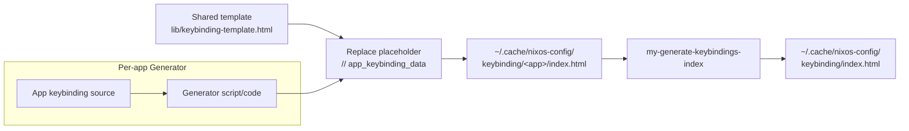
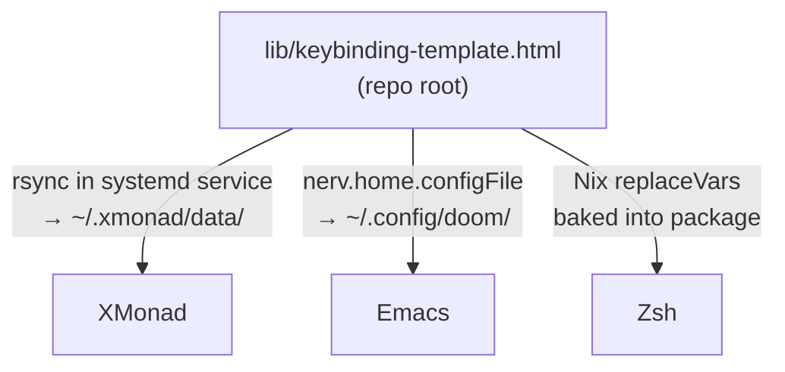

# Keybinding Export System Architecture

This document describes the keybinding HTML export system used across three applications: XMonad, Emacs, and Zsh.

## Overview

Each app has its own **generator** that extracts keybindings from app-specific sources, formats them as JS data, injects them into a **shared HTML template**, and writes the result to `~/.cache/nixos-config/keybinding/<app>/index.html`. A separate **index generator** (`my-generate-keybindings-index`) scans that directory and produces the main index page.

## Data Flow



## Template Delivery per App

Each app uses a different mechanism to make the shared template available at runtime:



## Per-App Summary

| | XMonad | Emacs | Zsh |
|---|---|---|---|
| **Trigger** | Automatic on XMonad start/restart | Manual: `M-x nerv/export-keybindings` | Manual: `Alt+Shift+F1` in terminal |
| **Data source** | Haskell keybinding definitions | `describe-bindings` output | `bindkey -L` output |
| **Generator** | Haskell (`KeybindingsExport.hs`) | Elisp (`keybindings-export.el`) | Zsh script (`my-generate-zsh-keybindings.zsh`) |
| **Template delivery** | rsync in systemd user service | `nerv.home.configFile` (symlink) | Baked into Nix package via `replaceVars` |
| **Modifier map** | `M`=Super, `C`=Ctrl, `S`=Shift, `M1`=Alt | `C`=Ctrl, `M`=Alt, `s`=Super, `S`=Shift | `C`=Ctrl, `M`=Alt, `S`=Shift |
| **Output** | `~/.cache/nixos-config/keybinding/xmonad/index.html` | `~/.cache/nixos-config/keybinding/emacs/index.html` | `~/.cache/nixos-config/keybinding/zsh/index.html` |

## Shared Data Format

All generators produce JS that replaces the `// app_keybinding_data` placeholder in the template:

```js
const appConfig = {
    title: 'App Name',
    modifiers: { 'C': 'Ctrl', 'M': 'Alt', 'S': 'Shift' }
};
const categories = {
    'category-id': 'Display Name',
    // ...
};
const keybindings = [
    ['C-x f', 'category-id', 'Action description'],
    // ...
];
```

- **Combo format**: Modifiers separated by `-`, parts of a chord separated by space (e.g. `C-x f`)
- **Categories**: ID used in keybindings array, display name shown in UI
- The template JS handles key parsing, color assignment, keyboard visualization, and search/filter

## Key Files

| File | Purpose |
|---|---|
| `lib/keybinding-template.html` | Shared HTML/JS/CSS template |
| `packages/my-generate-keybindings-index/` | Index page generator (scans keybinding dir) |
| `packages/my-generate-zsh-keybindings/` | Zsh keybinding generator package |
| `modules/nixos/opt/desktop/xmonad/.xmonad/lib/My/KeybindingsExport.hs` | XMonad generator |
| `modules/nixos/opt/apps/emacs/config_doom/keybindings-export.el` | Emacs generator |
| `modules/nixos/opt/user/default.nix` | Zsh widget + hotkey binding |
| `modules/nixos/opt/user/README.zsh.md` | Zsh keybinding reference |
| `docs/keybinding/` | Cached HTML copies (updated via `make update-doc`) |

## Adding a New App

1. **Create a generator** that reads keybindings from the app and outputs JS in the shared data format above
2. **Set `appConfig.modifiers`** to match the app's key notation
3. **Deliver the template** to where the generator can read it (choose: Nix `replaceVars`, `configFile` symlink, or rsync)
4. **Replace** `// app_keybinding_data` in the template with generated JS data
5. **Write output** to `~/.cache/nixos-config/keybinding/<app-name>/index.html`
6. **Call** `my-generate-keybindings-index` to rebuild the main index page
7. **Update** `CLAUDE.md` "Existing generators" list
8. **Run** `make update-doc` to copy HTML to `docs/keybinding/`
